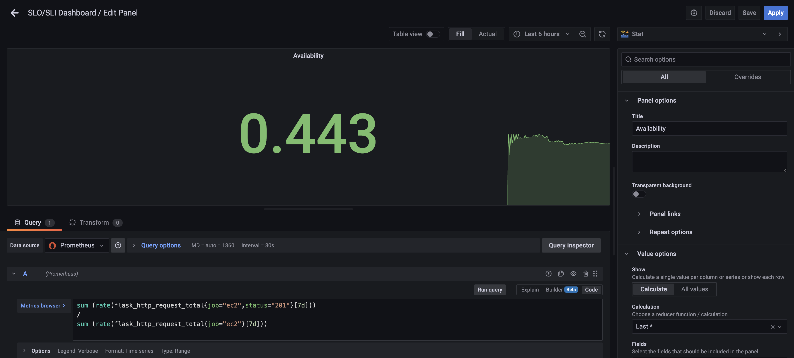
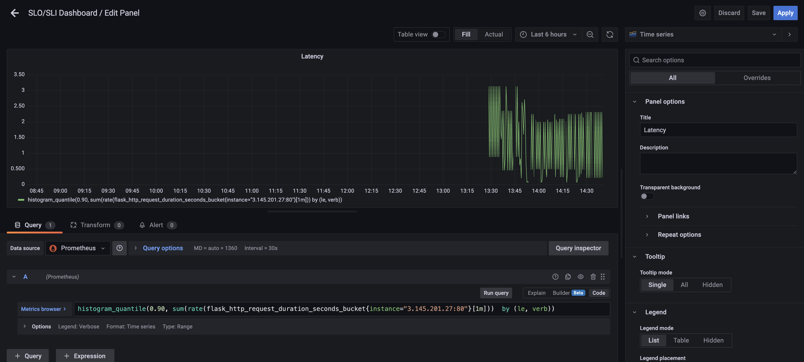
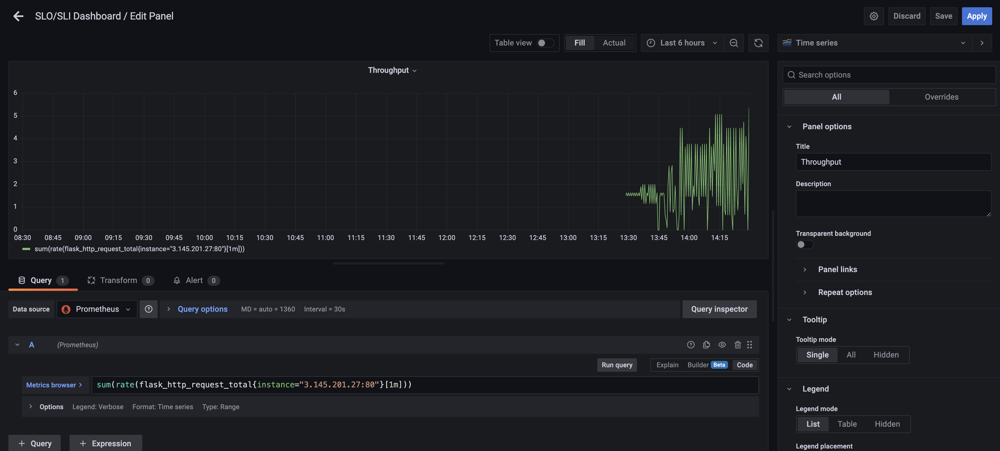
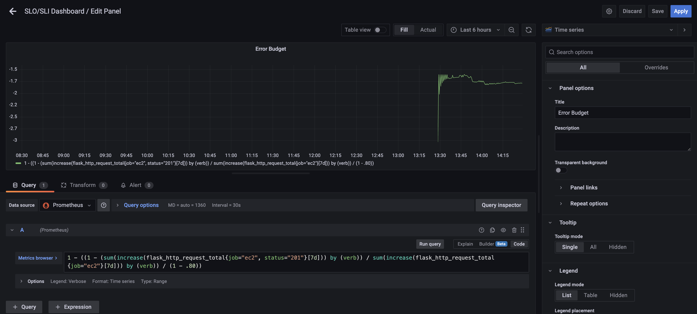

## Availability SLI
### The percentage of successful requests over the last 5m

```
sum (rate(flask_http_request_total{job="ec2",status="201"}[7d]))
/
sum (rate(flask_http_request_total{job="ec2"}[7d]))

```



## Latency SLI
### 90% of requests finish in these times

```
histogram_quantile(0.90, sum(rate(flask_http_request_duration_seconds_bucket{instance="3.145.201.27:80"}[1m]))  by (le, verb))
```


## Throughput
### Successful requests per second

```
sum(rate(flask_http_request_total{instance="3.145.201.27:80"}[1m]))
```


## Error Budget - Remaining Error Budget
### The error budget is 20%

```
1 - ((1 - (sum(increase(flask_http_request_total{job="ec2", status="201"}[7d])) by (verb)) / sum(increase(flask_http_request_total{job="ec2"}[7d])) by (verb)) / (1 - .80))
```

